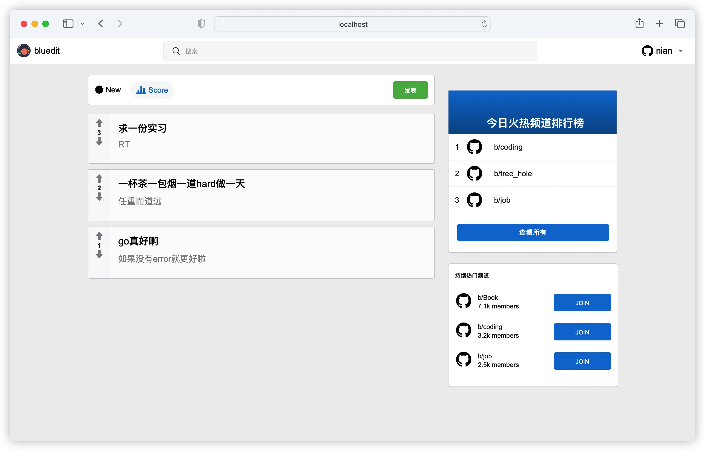
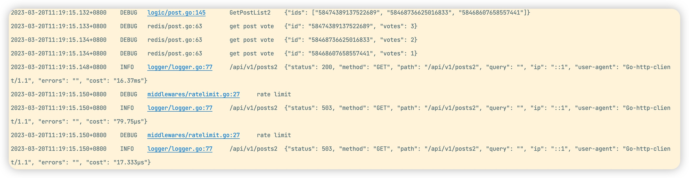

## 技术栈

1. gin框架
2. zap日志库
3. Viper配置管理
4. swagger生成文档
5. JWT认证
6. 令牌桶限流
7. Go语言操作MySQL
8. Go语言操作Redis

## 项目目录结构

```bash
.
├── conf
├── controller
├── dao
│   ├── mysql
│   └── redis
├── docs
├── log
├── logger
├── logic
├── middlewares
├── models
├── pkg
│   ├── jwt
│   └── snowflake
├── routers
├── settings
├── static
│   ├── css
│   ├── img
│   └── js
└── templates
```

## 项目预览图



## 压力测试

设置全局中间件，令牌桶令牌256个，分别用`go-stress-test`测试400、1024、2048个ping请求的执行情况。

```go
v1.Use(middlewares.RateLimitMiddleware(10*time.Millisecond,256))
func RateLimitMiddleware(fillInterval time.Duration, cap int64) func(c *gin.Context) {
	bucket := ratelimit.NewBucket(fillInterval, cap)
	return func(c *gin.Context) {
		// 如果取不到令牌就中断本次请求返回 rate limit...
		if bucket.TakeAvailable(1) == 0 {
			c.String(http.StatusOK, "rate limit...")
			c.Abort()
			return
		}
		// 取到令牌就放行
		c.Next()
	}
}
```

测试结果如下：可以看到前315个请求请求成功，197个请求失败，因为令牌桶的256歌令牌被取完、恢复的令牌也被用完，此时令牌桶为空时的请求全部返回503，请求失败。

```bash
dochengzz@chengnizhideair go-stress-testing % go run main.go -c 1 -n 512 -u http://localhost:8081/api/v1/posts2

 开始启动  并发数:1 请求数:512 请求参数: 
request:
 form:http 
 url:http://localhost:8081/api/v1/posts2 
 method:GET 
 headers:map[Content-Type:application/x-www-form-urlencoded; charset=utf-8] 
 data: 
 verify:statusCode 
 timeout:30s 
 debug:false 
 http2.0：false 
 keepalive：false 
 maxCo


─────┬───────┬───────┬───────┬────────┬────────┬────────┬────────┬────────┬────────┬────────
 耗时│ 并发数│ 成功数│ 失败数│   qps  │最长耗时│最短耗时│平均耗时│下载字节│字节每秒│ 状态码
─────┼───────┼───────┼───────┼────────┼────────┼────────┼────────┼────────┼────────┼────────
   1s│      1│     53│      0│   53.24│   52.75│   15.51│   18.78│  50,774│  50,758│200:53
   2s│      1│    109│      0│   54.98│   52.75│   15.51│   18.19│ 104,422│  52,186│200:109
   3s│      1│    166│      0│   55.57│   52.75│   15.18│   17.99│ 159,028│  53,001│200:166
   4s│      1│    216│      0│   54.40│   74.79│   15.18│   18.38│ 206,928│  51,724│200:216
   5s│      1│    270│      0│   54.23│   74.79│   15.06│   18.44│ 258,660│  51,725│200:270
   6s│      1│    315│    197│   53.68│   74.79│    0.27│   18.63│ 304,331│  51,672│200:315;503:197


*************************  结果 stat  ****************************
处理协程数量: 1
请求总数（并发数*请求数 -c * -n）: 512 总请求时间: 5.890 秒 successNum: 315 failureNum: 197
tp90: 18.000
tp95: 20.000
tp99: 28.000
*************************  结果 end   ****************************
```

在日志中可以看到前一个get请求返回了论坛首页的3个帖子，后一个请求因为令牌桶已经空的原因终止了请求。


